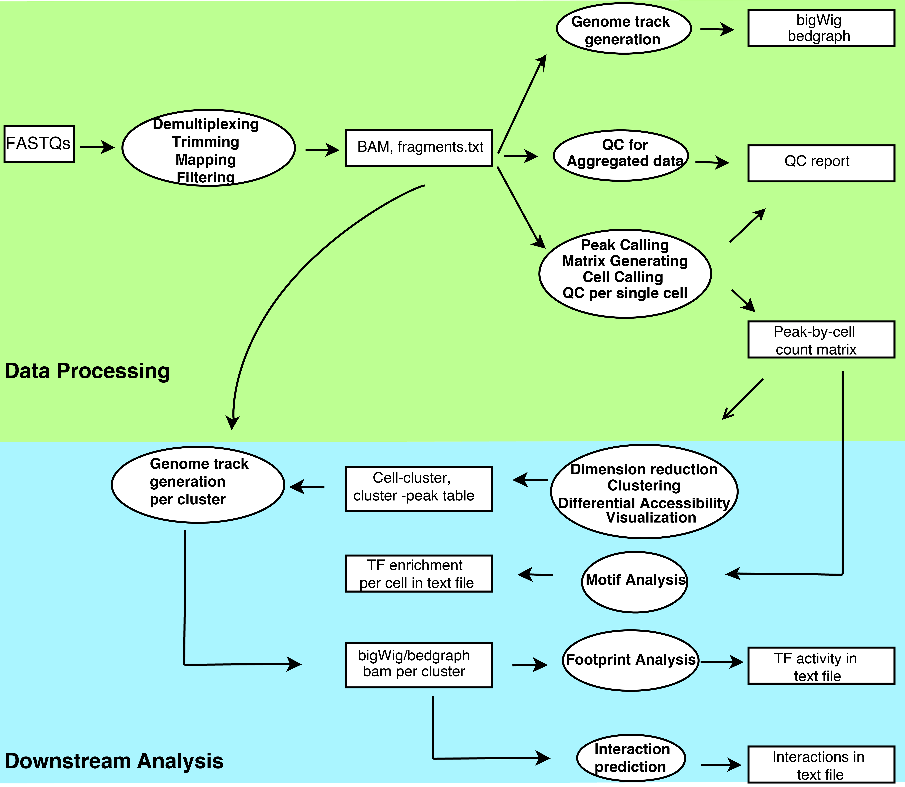

scATAC-pro
=================

[](https://zenodo.org/badge/latestdoi/187909420)

A comprehensive workbench for single cell ATAC-seq data processing, analysis and visualization


   * [scATAC-pro](#scatac-pro)
      * [Workflow](#workflow)
      * [Updates](#updates)
      * [Installation](#installation)
      * [FAQs](#FAQs)
      * [Dependencies](#dependencies)
         * [Programming language users should install](#programming-language-users-should-install)
         * [Software packages required](#software-pacakges-required)
      * [One command for many](#one-command-for-many)
      * [Step by step guide to running scATAC-pro](#step-by-step-guide-to-running-scATAC-pro)
      * [Detailed usage](#detailed-usage)
      * [Run scATAC-pro through docker or singularity](#run-scATAC-pro-through-docker-or-singularity)
      * [Access QC in R](#access-qc-in-R)
      * [Downstream Analysis in R](#downstream-analysis-in-R)
      * [Citation](#citation)


Workflow
--------

scATAC-pro consists of two units, the data processing unit and the downstream analysis unit. The data processing unit takes raw fastq files as input and outputs peak-by-cell count matrix, QC report and genome track files. It consists of the following modules: demultiplexing, adaptor trimming, read mapping, peak calling, cell calling, genome track file generation and quality control assessment. The downstream analysis unit consists of the following modules: dimension reduction, cell clustering, differential accessibility analysis, gene ontology analysis, TF motif enrichment analysis, TF footprinting analysis, linking regulatory DNA sequences with gene promoters, and integration of multiple datasets. We provide flexible options for most of analysis modules.


<p align="center">
  
</p>

Installation
------------

-   Note: It is not necessary to install scATAC-pro from scratch. You can use the docker or singularity version if your system support (see [Run scATAC-pro through docker or singularity](#run-scATAC-pro-through-docker-or-singularity) )
-   Run the following command in your terminal, scATAC-pro will be installed in YOUR\_INSTALL\_PATH/scATAC-pro\_1.5.2

<!-- -->

    $ git clone https://github.com/wbaopaul/scATAC-pro.git
    $ cd scATAC-pro
    $ make configure prefix=YOUR_INSTALL_PATH
    $ make install
     
Updates
------------
- Now provide [scATAC-pro tutorial in R](https://scatacpro-in-r.netlify.app/index.html) for access QC metrics and perform downstream analysis
- Current version: 1.5.2
- Highlighted updates
    * Be compatible with Seurat v5 (v1.5.2)
    * **integrate** module takes input as a [SampleSheet](SampleSheet.csv) file, in which sample names, paths of peaks, fragments and cell barcodes files for each sample can be specified. Other parameters for integration are specified in the [configure_user](configure_user.txt) file (v1.5.1)
    * New module **reprocess_cellranger_output** added, to reprocess 10x scATAC-seq data (including atac in 10x multiome assay) originally processed by cellranger, taking cellranger processed .bam and .fragments.tsv.gz files as input (v1.4.3)
    * More friendly to single-end sequencing data (v1.4.2)
    * New module *labelTransfer* added, to do label trasfer (for cell annotation) from cell annotation of scRNA-seq data. First construct a gene by cell activity matrix, then use *FindTransferAnchors* and *TransferData* function from Seurat R package to predicted cell type annotation from the cell annotaiton in scRNA-seq data (v1.4.0)
    * New module *rmDoublets* added,to remove potential doublets using [DoubletFinder](https://github.com/chris-mcginnis-ucsf/DoubletFinder) algorithm (v1.3.1)
    * *footprint* module: support comparison of any two sets of cell clusters (v1.3.0)
    * *integrate*: add VFACS (Variable Features Across ClusterS) option for the integration module,
      **which reselect highly variable features across cell clusters after an initial clustering, followed by 
        another round of dimension reduction and clustering**, specify *Integrate_By = VFACS* in configure file,
        rare peaks (accessible in less than 1% of cells) were also removed from the highly variable features list (v1.1.2).
- Complete update history can be viewd [here](complete_update_history.md)


FAQs
--------------
- [How to proceed using 10x cellranger-atac output?](https://github.com/wbaopaul/scATAC-pro/wiki/FAQs)
- [How to merge different peaks called from different data sets?](https://github.com/wbaopaul/scATAC-pro/wiki/FAQs)
- [How to reconstruct peak-by-cell matrix after updating peak file?](https://github.com/wbaopaul/scATAC-pro/wiki/FAQs)
- [How to access QC results in R?](https://scatacpro-in-r.netlify.app/qc_in_r)
- [How to access or redo downstream analysis in R?](https://scatacpro-in-r.netlify.app/downstream_in_r)


Dependencies
------------

### Programming language users should install

-   R (&gt;=3.6.1)
-   Python (&gt;=3.6.0)
-   Perl (pre-installed in most unix systems)

### Software packages required

**The following packages will be automatically installed if NOT detected by the installation script.**

-   BWA (&gt;=0.7.17), bowtie, bowtie2
-   MACS2 (&gt;=2.2.5)
-   samtools (&gt;=1.9)
-   bedtools (&gt;=2.27.1), bedops, tabix
-   deepTools (&gt;=3.2.1)
-   trim\_galore (&gt;=0.6.3), Trimmomatic (&gt;=0.6.3)
-   Regulratory Genomics Toolbox (RGT, for footprinting analysis)
-   g++ compiler, bzip2, ncurses-devel
-   R packaages: devtools, flexdashboard, png, data.table, Matirx, Rcpp, ggplot2, flexmix, optparse, magrittr, readr, Seurat, bedr, gridExtra, ggrepel, kableExtra, viridis, xlsx, RColorBrewer,pheatmap,motifmatchr, chromVAR, chromVARmotifs, SummarizedExperiment, BiocParallel, DESeq2, clusterProfiler, BSgenome.Hsapiens.UCSC.hg38, BSgenome.Mmusculus.UCSC.mm10, EnsDb.Hsapiens.v86, EnsDb.Mmusculus.v79, VisCello.atac

One command for many
-----------

-   **Input**: 
    -   fastq files for pair-end1 reads(pe1_fastq.gz), pair-end2 reads(pe2_fastq_gz) and cell barcords (index_fastq.gz) 

    -   **for data generated by 10x, you can just speficy the path to each FASTQ files folder per sample**

-   **IMPORTANT**: The parameters and options should be specified in a configurartion file in plain text format. Copy and edit the *configure\_user.txt* file in this repository and then in your terminal run the following commands:

```
    $ scATAC-pro -s process 
                 -i pe1.fastq.gz,pe2.fastq.gz,index.fastq.gz(,other_index_fastq.gz) 
                 -c configure_user.txt 

    $ scATAC-pro -s downstream 
                 -i output/filtered_matrix/PEAK_CALLER/CELL_CALLER/matrix.mtx (or matrix.rds) 
                 -c configure_user.txt

    ## PEAK_CALLER and CELL_CALLER is specified in your configure_user.txt file

```

-   If fastq files are generated using 10x genomics platform, you can just specify the path to fastq folder for a sample:

```
    $ scATAC-pro -s process 
                 -i PATH_TO_10x_fastqs_directory 
                 -c configure_user.txt 
```

-   For data processing, if fastq files have been demultiplexed as the required format with the barcode recorded in the name of each read as @barcode:ORIGIN\_READ\_NAME , you can skip the demultiplexing step by running the following command:

```
    $ scATAC-pro -s process_no_dex 
                 -i pe1_fastq,pe2_fastq
                 -c configure_user.txt 
```

-   To reprocess data originally processed by cellranger:

```
    $ scATAC-pro -s reprocess_cellranger_output
                 -i cellranger_generated.bam_file,cellranger_generated_fragments.tsv.gz_file
                 -c configure_user.txt

```

- **NOTE**: 
  - Some large mapping index and genome annotation files can be downloaded [here](https://chopri.box.com/s/dlqybg6agug46obiu3mhevofnq4vit4t)
  - The **output** will be saved under ./output as default
  - --verbose (or -b) will print the running message on screen, otherwise the message will only be saved under output/logs/MODULE.txt
  - To access QC metrics and perform downstream analysis in R, see [scATAC-pro tutorial in R](https://scatacpro-in-r.netlify.app/index.html) 


Step by step guide to running scATAC-pro
---------------------------

-   **IMPORTANT**: you can run scATAC-pro sequentially. The input of a later analysis module is the output of the previous analysis modules. The following tutorial uses fastq files downloaded from [PBMC10k 10X Genomics](https://support.10xgenomics.com/single-cell-atac/datasets/1.1.0/atac_v1_pbmc_10k?) 
    
-   <u>Run scATAC-pro sequentially (specify PEAK_CALLER = MACS2 and CELL_CALLER = FILTER or other values in the configure_user.txt file) </u>

```
    $ scATAC-pro -s demplx_fastq 
                 -i pe1_fastq.gz,pe2_fastq.gz,index_fastq.gz(,other_index_fastq.gz, ...) 
                 -c configure_user.txt 
    # or for 10x data
    $ scATAC-pro -s demplx_fastq 
                 -i pbmc_10x_fastqs/ 
                 -c configure_user.txt 

    $ scATAC-pro -s trimming 
                 -i output/demplxed_fastq/pbmc10k.demplxed.PE1.fastq.gz,
                    output/demplxed_fastq/pbmc10k.demplxed.PE2.fastq.gz
                 -c configure_user.txt 

    $ scATAC-pro -s mapping 
                  -i output/trimmed_fastq/pbmc10k.trimmed.demplxed.PE1.fastq.gz,
                     output/trimmed_fastq/pbmc10k.trimmed.demplxed.PE2.fastq.gz,
                  -c configure_user.txt 

    $ scATAC-pro -s call_peak 
                 -i output/mapping_result/pbmc10k.positionsort.MAPQ30.bam
                 -c configure_user.txt 

    $ scATAC-pro -s aggr_signal 
                 -i output/mapping_result/pbmc10k.positionsort.MAPQ30.bam 
                 -c configure_user.txt 
                 
    $ scATAC-pro -s get_mtx 
                 -i output/summary/pbmc10k.fragments.tsv.gz,output/peaks/PEAK_CALLER/pbmc10k_features_BlacklistRemoved.bed 
                 -c configure_user.txt 

    $ scATAC-pro -s qc_per_barcode 
                 -i output/summary/pbmc10k.fragments.tsv.gz,output/peaks/PEAK_CALLER/pbmc10k_features_BlacklistRemoved.bed 
                 -c configure_user.txt

    $ scATAC-pro -s call_cell
                 -i output/raw_matrix/PEAK_CALLER/matrix.mtx (or matrix.rds)
                 -c configure_user.txt
                 
    $ scATAC-pro -s get_bam4Cells
                 -i output/mapping_result/pbmc10k.positionsort.bam,
                    output/filtered_matrix/PEAK_CALLER/CELL_CALLER/barcodes.txt
                 -c configure_user.txt
    
    ## after running the above module, you can run module report (list below)
    ## to generate first page of the summary report
    $ scATAC-pro -s rmDoublets
                 -i output/filtered_matrix/PEAK_CALLER/CELL_CALLER/matrix.rds,0.03 (0.03 is the default expected fraction of doublets ) 
                 -c configure_user.txt

    $ scATAC-pro -s clustering
                 -i output/filtered_matrix/PEAK_CALLER/CELL_CALLER/matrix.rds (or a seurat_obj.rds file ) 
                 -c configure_user.txt

    $ scATAC-pro -s motif_analysis
                 -i output/filtered_matrix/PEAK_CALLER/CELL_CALLER/matrix.rds (or matrix.mtx, or seurat_obj.rds file) 
                 -c configure_user.txt
                 
    $ scATAC-pro -s split_bam
                 -i output/downstream_analysis/PEAK_CALLER/CELL_CALLER/cell_cluster_table.tsv
                 -c configure_user.txt

    $ scATAC-pro -s footprint ## supporting comparison two groups of cell clusters, and one-vs-rest
                 -i 0,1  ## or '0:3,1:2' (group1 consist of cluster0,3, and group2 for cluster1,2)) or 'one,rest' (all one-vs-rest comparison)
                 -c configure_user.txt
                 
    $ scATAC-pro -s runCicero
                 -i output/downstream_analysis/PEAK_CALLER/CELL_CALLER/seurat_obj.rds
                 -c configure_user.txt

    $ scATAC-pro -s runDA
                 -i output/downstream_analysis/PEAK_CALLER/CELL_CALLER/seurat_obj.rds,0:1:3,2  ## group1 consist of cluster 0,1,and 3; group2 cluster2 
                 -c configure_user.txt
                 
    $ scATAC-pro -s runGO
                 -i output/filtered_matrix/PEAK_CALLER/CELL_CALLER/differential_accessible_features_0:1:3_vs_2.tsv,  
                 -c configure_user.txt
                 
    $ scATAC-pro -s report
                 -i output/summary
                 -c configure_user.txt
                 
    $ scATAC-pro -s report_dynamic
                 -i output/summary
                 -c configure_user.txt
    ##report_dynamic regnerates dynamic report which can explore chromatin interactions and coverage plots (still in testing), requiring access to a internet browser.

    ## merge peaks with qvlue < 0.01 (be able to filtering by qvalue since v1.5.0) and within 500bp distance of each other            
    $ scATAC-pro -s mergePeaks
                 -i peak_file1,peak_file2,...,peak_fileN,500,0.01
                 -c configure_user.txt

    ## reconstruct matrix using given new peak file
    $ scATAC-pro -s reConstMtx
                 -i peakFilePath,fragmentFilePath,barcodesPath,reconstructedMatrixPath(optional)
                 -c configure_user.txt


    ## perform integrated analysis, assuming all data sets are processed by scATAC-pro
    ## which means each fragments.txt and barcodes.txt files can be found correspondingly            
    ## the integration methods includes 'VFACS', 'pool', 'seurat', 'cca', 'rpca', 'rlsi' and 'harmony', for instance, 
    ## you can specify the integration method with 'Integrate_By = VFACS' in the configure file
    $ scATAC-pro -s integrate
                 -i peak_file1,peak_file2,...,peak_fileN,500,0.01 
                 -c configure_user.txt
    
    or (since v1.5.2)
    $ scATAC-pro -s integrate
                 -i SampleSheet.cvs 
                 -c configure_user.txt
    
    
    ## if you have the reconstructed matrix for data set (meaning using the merged peaks)
    ## you can run the *integrate_mtx* whtich is second part of the module *integrate*            

    $ scATAC-pro -s integrate_mtx
                 -i reconstructed_mtx_file1,reconstructed_mtx_file2,(reconstructed_mtx_file3...)   
                 -c configure_user.txt


    ## label transfer (cell annotation) from scRNA-seq
    ## cell annotated with metadata 'Cell_Type' in seurat obj of scRNA-seq data
    ## the gtf_file is optional
    $ scATAC-pro -s labelTransfer
                 -i seurat_obj_atac.rds,seurat_obj_rna.rds(,gtf_file)   
                 -c configure_user.txt
```


- After clustering, user can interactively visualize and analyze the data with module *visualize* 

```
scATAC-pro -s visualize -i output/downstream_analysis/PEAK_CALLER/CELL_CALLER/VisCello_obj -c configure_user.txt

```
- Note that the visualization can also be done through R/Rstudio:

```
devtools::install_github("qinzhu/VisCello", ref="VisCello-atac") ## install the package 

library(VisCello.atac)

cello('output/downstream_analysis/PEAK_CALLER/CELL_CALLER/VisCello_obj') ## launch VisCello in your web browser with prepared data
```

- More details about the visualization module can be found at [VisCello](https://github.com/qinzhu/VisCello/tree/VisCello-atac)

Detailed Usage
--------------

See [here](https://scatacpro-in-r.netlify.app/note_module) or in your terminal:

    $ scATAC-pro --help
    usage : scATAC-pro -s STEP -i INPUT -c CONFIG [-o] [-h] [-v]
    Use option -h|--help for more information

    scATAC-pro 1.5.2
    ---------------
    OPTIONS

       [-s|--step ANALYSIS_STEP] : run an analysis module (or some combination of several modules) of the scATAC-pro workflow, supported modules include:
          demplx_fastq: perform demultiplexing
                               input: either fastq files for both reads and index, separated by comma or path to folder of 
                                      10x fastq files like:
                                      PE1_fastq,PE2_fastq,index1_fastq,inde2_fastq,index3_fastq...or
                                      PATH_TO_10xfastqs_folder
                               output: Demultiplexed fastq1 and fastq2 files with index information embedded
                                       in the read name as:  @index3_index2_index1:original_read_name, saved in
                                       output/demplxed_fastq/ 
          trimming: trim read adapter
                               input: demultiplexed fastq1 and fastq2 files
                               output: trimmed demultiplexed fastq1 and fastq2 files, saved in output/trimmed_fastq/
          mapping: perform reads alignment
                             input: fastq files, separated by comma for each paired end
                             output: position sorted bam file saved in output/mapping_result, mapping qc stat and 
                                     fragment.txt files saved in output/summary
          call_peak: call peaks using aggregated data
                               input: BAM file, outputted from the mapping module
                               output: peaks in plain text format, saved as output/peaks/PEAK_CALLER/
                                       OUTPUT_PREFIX_features_Blacklist_Removed.bed
          get_mtx: build raw peak-by-cell matrix
                             input: fragments.tsv.gz file, outputted from the mapping module, and features/peak file, 
                                    outputted from the call_peak module, separated by a comma
                             output: sparse peak-by-cell count matrix in Matrix Market format, barcodes and feature files
                                     in plain text format, saved in output/raw_matrix/PEAK_CALLER/
          aggr_signal: generate aggregated signal, which can be uploaded to and viewed
                                 in genome browser
                                 input: BAM file, outputted from the mapping module
                                 output: Aggregated data in .bw and .bedgraph file, saved in output/signal/
          qc_per_barcode: generate quality control metrics for each barcode
                                    input: fragments.tsv.gz file (outputted from module mapping) and peak/feature file, 
                                           (outputted from module call_peak), separated by comma
                                     output: qc_per_barcode.txt file, saved in output/summary/
          call_cell: perform cell calling
                               input: raw peak-by-barcode matrix file, outputted from the get_mtx module
                               output: filtered peak-by-cell matrix in Market Matrix format, barcodes and features,
                                       saved in output/filtered_matrix/PEAK_CALLER/CELL_CALLER/
          get_bam4Cells: extract bam file for cell barcodes and calculate mapping stats correspondingly
                               input: A bam file for aggregated data outputted from mapping module and a barcodes.txt file
                                      outputted from module call_cell, separated by comma
                               output: A bam file saved in output/mapping_results and mapping stats (optional) saved
                                         in output/summary for cell barcodes                          
          process: processing data - including demplx_fastq, mapping, call_peak, get_mtx,
                                aggr_signal, qc_per_barcode, call_cell and get_bam4Cells
                                input: either fastq files for both reads and index, separated by comma, or path to folder
                                       of 10x fastq files like:
                                       fastq1,fastq2,index_fastq1,index_fastq2, index_fastq3..., or
                                       PATH_TO_10xfastqs_folder
                                output: peak-by-cell matrix and all intermediate results 
          process_no_dex: processing data without demultiplexing
                                input: demultiplexed fastq files for both reads, separated by a comma like:
                                       fastq1,fastq2; 
                                output: peak-by-cell matrix and all intermediate results 
          process_from_align: processing data from the alignment step (including alignment step)
                                input: demultiplexed and adapter trimmed fastq files for both reads, separated by a comma like:
                                       fastq1,fastq2; 
                                output: peak-by-cell matrix and all intermediate results 
          process_with_bam: processing from bam file
                                input: bam file for aggregated data, outputted from the mapping module 
                                output: filtered peak-by-cell matrix and all intermediate results 
          rmDoublets: remove potential doublets
                         input: a peak-by-cell matrix file or a seurat object file in .rds format
                         output: doublets removed  matrix.rds and barcodes.txt file and seurat objects w/ and w/o doublets saved in the input directory (and a umap plot colored by singlet/doubet) 
          clustering: cell clustering
                               input: filtered peak-by-cell matrix file, outputted from the call_cell module (or a seurat.rds file)
                               output: seurat objects with clustering label in the metadata (.rds file) and 
                                       barcodes with cluster labels (cell_cluster_table.tsv file), and umap plot colorred
                                       clustering label, saved in output/downstream_analysiss/PEAK_CALLER/CELL_CALLER/
          motif_analysis: perform TF motif analysis
                               input: filtered peak-by-cell matrix file, outputted from the call_cell module, or the seurat_obj.rds file
                                         outputted from clustering module
                               output: TF-by-cell enrichment matrix in chromVAR object, a table and heatmap indicating 
                                       TF enrichment for each cell cluster, saved in output/downstream_analysiss/
                                        PEAK_CALLER/CELL_CALLER/
          runDA: preform differential accessibility analysis
                           input: path_to_seurat_object with two groups of clusters to compare, could be like:
                                  seurat_obj.rds,0:1,2 (will compare cells in cluster 0 or cluster 1 with cells in cluster2 
                                  for the given seurat object) or
                                  seurat_obj.rds,0,rest (will compare cells in cluster 0 with the rest of cells) or
                                  seurat_obj.rds,one,rest (will compare cells in any one of the clusters with the rest of the cells)
                           output: differential accessibility peaks in a tsv file saved in the same in 
                                   the same folder of the input seurat object
          runGO: preform GO term enrichment analysis
                           input: differential accessible features file, outputted from runDA module (.tsv file)
                           output: enriched GO terms in .xlsx format saved in the same directory as the input file
          runCicero: run cicero for calculating gene activity score and predicting cis chromatin interactions
                           input: seurat_obj.rds file outputted from the clustering module
                           output: cicero gene activity in .rds format and predicted interactions in .txt format, saved
                                   in output/downstream_analysiss/PEAK_CALLER/CELL_CALLER/
          split_bam: split bam file into different clusters
                               input: barcodes with cluster label (cell_cluster_table.tsv file, outputted from 
                                      clustering module
                               output: .bam file (saved in output/downstream/PEAK_CALLER/CELL_CALLER/data_by_cluster), 
                                       .bw, .bedgraph (saved in output/signal/) file for each cluster
          footprint: perform TF footprinting analysis, supports comparison between two sets of cell clusters and one cluster vs
                     the rest of cell clusters (one-vs-rest)
                               input: 0:1,2  ## cluster0,1 vs cluster2 or 'one,rest' (all one-vs-rest)
                               output: footprinting summary statistics in tables and heatmap,
                                       saved in output/downstream/PEAK_CALLER/CELL_CALLER/
          downstream: perform all downstream analyses, including clustering, motif_analysis, 
                                split_bam (optional) and footprinting analysis (optional)
                                input: filtered peak-by-cell matrix file, outputted from call_cell module
                                output: all outputs from each module
          report: generate summary report in html file
                            input: directory to QC files, output/summary as default
                            output: summary report in html format, saved in output/summary and .eps figures for each panel
                                    saved in output/summary/Figures
          convert10xbam: convert bam file in 10x genomics format to bam file in scATAC-pro format 
                         input: bam file (position sorted) in 10x format
                         output: position sorted bam file in scATAC-pro format saved in output/mapping_result,
                                 mapping qc stat and fragment.txt files saved in output/summary/
          mergePeaks: merge peaks (called from different data sets) within a given distance (say 200bp), 
                      filtering each peak by qvalue, 0.01 for instance 
                         input: peak files and a distance parameter separated by comma: 
                                peakFile1,peakFile2,...,peakFileN,200,0.01
                         output: merged peaks saved in file output/peaks/merged.bed
          reconstMtx: reconstruct peak-by-cell matrix given peak file, fragments.tsv.gz file, barcodes.txt and 
                      an optional path for reconstructed matrix 
                         input: different files separated by comma:
                                peakFilePath,fragmentFilePath,barcodesPath,reconstructMatrixPath
                         output: reconstructed peak-by-cell matrix saved in reconstructMatrixPath, 
                                 if reconstructMatrixPath not specified, a sub-folder reConstruct_matrix will be created
                                 under the same path as the input barcodes.txt file
          integrate: perform integration of two ore more data sets
                           input: peak/feature files, a distance parameter and a qvalue cutoff separated by comma: peak_file1,peak_file2,...,peak_fileN,200,0.01
                           Note: input can be just a SampleSheet.csv file since v1.5.2
                           output: merged peaks, reconstructed matrix, integrated seurat obj and umap plot, saved in
                                   output/integrated/
          integrate_mtx: perform integration of two ore more data matrices given the reconstructed peak-by-cell matrix
                           input: mtx1,mtx2, separated by comma like, mtx1_path,mtx2_path
                           output: integrated seurat obj and umap plot, saved in output/integrated/
          visualize: interactively visualize the data through VisCello
                         input: VisCello_obj directory, outputted from the clustering module
                         output: launch VisCello through web browser for interactively visualization"

          addCB2bam: add cell barcode tag to bam file
                         input: a bam file generated by scATAC-pro
                         output: the bam file with column 'CB:Z:cellbarcode' added (saved in the same directory as
                                 the input bam file)
      
          labelTransfer: label transfer (cell annotation) from scRNA-seq data
                         input: paths for a seurat object for scATAC-seq, a seurat object for scRNA-seq data in .rds format,
                                and an optional .gtf file for gene annotation, separated by a comma. 
                         output: a updated seurat object for atac with the Predicted_Cell_Type as a metadata variable and
                                 an umap plot colored by Predicted_Cell_Type, saved in the same directory as the input atac
                                 seurat object.
                         NOTE: the cell annotation should be given as a metadata of the seurat object of
                               scRNA-seq. Both seurat objects should have pca and umap dimemsion reduction 
                               done.
          reprocess_cellreanger_output: re-process cellranger results 
                         input: cellranger_bam_file,cellranger_fragments.tsv.gz
                         output: all outputs of in data processing steps
        
       -i|--input INPUT : input data, different types of input data are required for different analysis
       -c|--conf CONFIG : configuration file for parameters (if exist) for each analysis module
       [-o|--output_dir : folder to save results, default output/ under the current directory; sub-folder will be created automatically for each analysis
       [-h|--help]: print help infromation on screen
       [-v|--version]: display current version numbe of scATAC-pro on screen
       [-b|--verbose]: print running message on screen


Run scATAC-pro through docker or singularity
----------------------------------
In case you have problem in installing dependencies, you can run scATAC-pro without installing dependencies as following:

1. Pull the docker image [here](https://hub.docker.com/r/wbaopaul/scatac-pro), and run it through singularity (which is more friendly with high performance cluster or HPC, and linux server) by running the following commands:

```
$ singularity pull -F docker://wbaopaul/scatac-pro:latest 
## will generate scatac-pro_latest.sif in current directory

$ singularity exec --bind YOUR_BIND_PATH -H YOUR_WORK_PATH --cleanenv scatac-pro_latest.sif scATAC-pro -s XXX -i XXX -c XXX

```

2. More commonly, use it on a HPC cluster, here is an example script for running mapping step in my case (please change the file paths to yours): 
  - write a script mapping.sh with something essially like this:

```
#!/bin/bash
module load singularity ## load singularity in your system

## pull the docker image
## generating scatac-pro_latest.sif in your current directory
singularity pull -F docker://wbaopaul/scatac-pro:latest  ## just need run this line once

singularity exec --bind /mnt/isilon/ --cleanenv -H /mnt/isilon/tan_lab/yuw1/run_scATAC-pro/PBMC10k scatac-pro_latest.sif \ 
scATAC-pro -s mapping -i fastq_PE1_file,fastq_PE2_file -c configure_user.txt

```
  - then sumbit your job on your HPC (e.g. qsub or sbatch mapping.sh)

  - **NOTE**: 
    - YOUR_WORK_PATH is your working directory, where the outputs will be saved 

    - All inputs including data paths specified in configure_user.txt should be accessible under YOUR_BIND_PATH

    - NOTE: if running the *footprint* module, remember to download the reference data [rgtdata](https://chopri.box.com/s/dlqybg6agug46obiu3mhevofnq4vit4t) folder into YOUR_WROK_PATH

[Access QC in R](https://scatacpro-in-r.netlify.app/qc_in_r)
---------------------------------------

[Downstream Analysis in R](https://scatacpro-in-r.netlify.app/downstream_in_r)
--------------------------------------

Citation
--------------------------------------
Yu W, Uzun Y, Zhu Q, Chen C, Tan K. [*scATAC-pro: a comprehensive workbench for single-cell chromatin accessibility sequencing data.*](https://genomebiology.biomedcentral.com/articles/10.1186/s13059-020-02008-0) Genome Biology; 2020 
